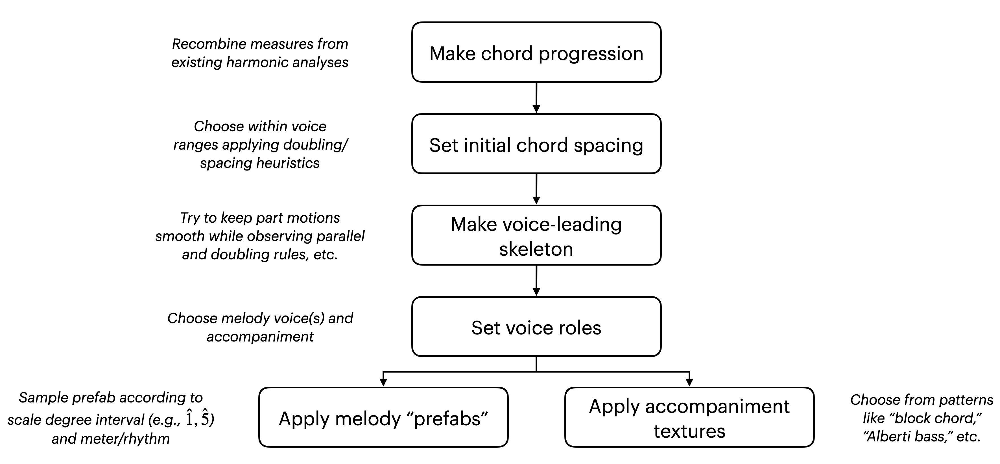

A project to generate synthetic Classical music annotated with chord changes.

The approach is purely rule-based. My goal here was to create augmented data for training Roman-numeral analysis models like the one in my [2024 ISMIR paper](https://malcolmsailor.com/2025/01/06/ISMIR.html). 

The general intuition behind the project is that the composition of music is a little bit like a one-way function. In other words, it is relatively easy to write rules to go from a chord progression to a musical surface, but harder to write rules to go from the musical surface to the chord progression.

While it was a fun project and the generated music can be amusing to listen to, I didn't find that it improved the test performance of my trained models, presumably because the synthetic data lies too far out of distribution. It's possible that refining the code to produce better music would render it useful, but for now I do not plan to pursue this research direction further.

There is further discussion of this project in my upcoming dissertation.

# Contents

- [Scripts](#Scripts)
- [Usage](#Usage)
- [Discussion](#Discussion)

# Scripts

There are four main scripts. For usage, see [Usage](#Usage) below.

```
scripts/run_incremental_contrapuntist.py
scripts/run_incremental_contrapuntist_with_accomps.py
scripts/run_incremental_contrapuntist_with_prefabs.py
scripts/run_incremental_contrapuntist_with_prefabs_and_accomps.py
```

Each of these generate music in batch, taking a chord progression or progressions as inputs. They each follow a slightly different procedure:

- `run_incremental_contrapuntist.py`: makes a four-part chorale-style realization. The realization may contain suspensions but is otherwise unornamented. [Listen to an example (score excerpt below)](docs/audio/mozart_structural_0000192.mp3).


- `run_incremental_contrapuntist_with_accomps`: makes accompanimental patterns like block-chords and Alberti basses. [Listen to an example (score excerpt below)](docs/audio/mozart_accomps_0000423.mp3)


- `run_incremental_contrapuntist_with_prefabs.py`: adds "prefabricated" melodic/rhythmic ornamentation to an underlying four-part realization. [Listen to an example (score excerpt below)](docs/audio/mozart_prefabs_0000874.mp3)


- `run_incremental_contrapuntist_with_prefabs_and_accomps.py`: add both accompanimental patterns and melodic/rhythmic ornamentation to an underlying four-part realization. [Listen to an example (score excerpt below)](docs/audio/mozart_prefabs_and_accomps_0000146.mp3)


The examples above show the start of each MIDI file when opened in MuseScore. To any of my fellow punctilious music theorists, I apologize for the infelicitous enharmonic notations.


# Usage

The only required arguments for each script are

- one or more RomanText files containing chord progressions to realize as positional arguments. (In `docs/examples`, I have placed two example RomanText files from the [When In Rome](https://github.com/MarkGotham/When-in-Rome) corpus.)
- `--output-folder`, specifying where to save the output.

For example:

```bash
python scripts/run_incremental_contrapuntist_with_prefabs_and_accomps.py \
    docs/examples/Bach_Chorale_1.txt \
    docs/examples/Beethoven_Sonata_2_ii.txt \
    --output-folder ~/tmp/dumb_composer_output
```

The remaining arguments are undocumented for the time being, but their usage can be inferred from `user_scripts/synthetic_data.sh` which shows how I used these scripts to build a synthetic dataset.

Note that the script may fail on a given input file if it is long or complex.

# Discussion

The procedure for generating synthetic data is sketched in the following flow chart. Many details are omitted (for example, the application of suspensions to the voice-leading skeleton). The first step ("Make chord progression") was carried out by a separate Python script, not included in this repository.


